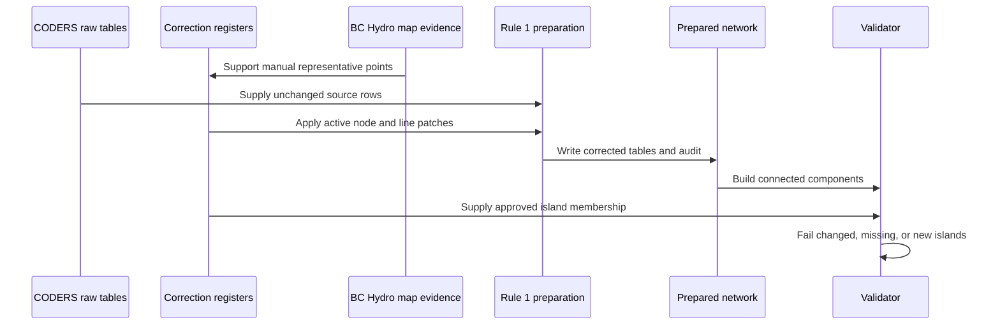

# Base-network correction register

This directory contains explicit, reviewable patches applied during Rule 1.
Raw CODERS files are never edited. Every active patch records its source,
rationale, method, confidence, and whether manual judgement was involved.

## BC Hydro map evidence

The reference is the **BC Hydro Provincial Transmission System Map**, drawing
G-T06-00010, April 2025:

https://www.bchydro.com/content/dam/BCHydro/customer-portal/documents/transmission/maps/transmission-system.pdf

Run the following to reproduce the local evidence copy and checksum metadata:

```bash
uv run python -m workflow.scripts.fetch_base_network_validation
```

The map is schematic and not a survey product. Coordinates digitized or
interpreted from it are representative plotting/model-topology points only.
They must not be used to calculate engineering line length, impedance,
right-of-way, or asset position.

## Goldstream Junction

The map explicitly shows circuit `60L223` in the order
`MCA -> GST -> MCK -> GSM`. CODERS provides coordinates for Mica (`MCA`) and
McCulloch Creek (`MCK`) but not Goldstream Junction (`GST`). The representative
GST point is placed along the straight MCA-MCK coordinate vector using the
CODERS segment ratio:

```text
fraction from MCA = 34.68 / (34.68 + 10.00) = 0.776186
GST longitude     = -118.540762
GST latitude      =   51.743490
```

This is a special, non-automated treatment recorded as `NODE-001`.

## Historical exchange treatment

Trading is exogenous to the initial hydro-policy study. Rule 1 therefore keeps
each physical boundary segment and creates a representative external endpoint.
Later model preparation should aggregate these into Alberta and United States
interfaces and apply historical exchange as fixed time series:

- import component: non-negative fixed injection;
- export component: non-negative fixed withdrawal;
- `import_t = max(-net_exchange_t, 0)` and
  `export_t = max(net_exchange_t, 0)`, after documenting the source sign convention.

The exchange should not be optimized and should not receive an endogenous
market price in the base study. Alternative trade assumptions belong in a
sensitivity analysis.

## Line treatments

- `32350`: excluded because Kidd #1 and Kidd #2 collapse to the same CODERS
  node code. Reintroduce only if distinct electrical endpoints are documented.
- `32731`: excluded because both Dasque Creek endpoints are identical; treated
  as an internal/duplicated plant connection.
- `31876`: zero summer rating is replaced with 65 MW, matching both adjacent
  `1L365` segments (`31874`, `31875`). The standard 0.9 power-factor conversion
  then produces `s_nom = 72.2222 MVA`.
- Eight intertie lines are retained and paired with registered representative
  boundary buses.
- `32550` and `32552` are retained after adding the GST representative bus.

## Processing and validation


