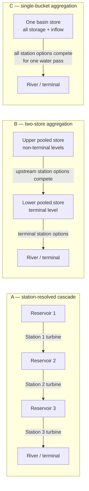

# Matched hydraulic-representation methods

**Study:** How Hydropower Cascade Aggregation Affects Operational Feasibility
Estimates in a Hydro-Dominant Power System  
**Implementation date:** 2026-07-31  
**Code:** `src/pypsa_bc/studies/cascade/representation.py`  
**Verification:** `gate2/representation_verification.md`

## Experimental purpose

The study compares three hydraulic representations while holding the resource
and electrical systems constant. The treatment is therefore the loss of
hydraulic sequencing and reservoir-state detail—not a simultaneous change in
installed generation, inflow, storage volume, network geography, or ecological
routes.



Explicit spill, bypass, canyon, creek, and environmental-release routes that
leave the modeled reservoir chain remain connected to their original external
water buses in every representation.

## Configuration A: station-resolved cascade

Configuration A retains one controllable Store per modeled reservoir, the
station-resolved turbine and spill links, and the physical downstream reservoir
or terminal assigned in the evidence register. A unit of water may therefore
generate at successive stations when it traverses the cascade. This is the
reference treatment.

## Configuration B: two-store aggregation

For cascade group (g), let (o_i) be the order of station (i) and
(o_g^{max}) the terminal order. The bucket assignment is

\[
b_i =
\begin{cases}
L, & o_i = o_g^{max} \\
U, & o_i < o_g^{max}.
\end{cases}
\]

All controllable storage and natural inflow associated with non-terminal levels
are assigned to the upper bucket (U). Storage and inflow at the terminal level
are assigned to the lower bucket (L). Upstream station turbine options compete
for water in (U) and discharge to (L). Terminal station options withdraw from
(L) and discharge to the observed terminal. A basin with no documented
controllable storage in one bucket receives a water bus but no invented Store.

This treatment preserves two broad water-management states while removing
within-upper-pool ordering. In a three-level cascade, for example, levels one
and two compete for pooled upper water rather than receiving the same unit of
water sequentially.

## Configuration C: single-bucket aggregation

All modeled controllable storage and natural inflow in cascade group (g) are
assigned to one basin bucket. Every station turbine option withdraws from that
bucket. Internal reservoir destinations are replaced by the observed terminal,
so the same unit of water cannot circulate through multiple turbine links or
generate repeatedly through an artificial self-loop. External ecological or
diversion routes are preserved.

Configuration C deliberately removes all modeled internal sequencing. It is
therefore the strongest aggregation treatment, not an assertion that a real
basin is operated as a literal single reservoir.

## Matched invariants

For every cascade group (g) and each transformed representation (r\in\{B,C\}),
the implementation verifies:

\[
\sum_{s\in g} E^{A}_{s} = \sum_{k\in g,r} E^{r}_{k},
\]

where (E) is controllable storage volume in m³;

\[
\sum_{t}\sum_{j\in g} I^{A}_{j,t}
=
\sum_{t}\sum_{j\in g} I^{r}_{j,t},
\]

where (I) is hourly natural inflow in m³/h; and

\[
\sum_{i\in g} Q^{A,max}_{i}
=
\sum_{i\in g} Q^{r,max}_{i},
\]

where (Q^{max}) is turbine water capacity in m³/h. Station link names,
water-to-power efficiencies, nominal turbine capacities, marginal costs, and
electrical output buses are unchanged. Initial stored volume is summed into the
new bucket or buckets, and the source cyclic-boundary convention is retained
where controllable stores exist.

The verifier also requires:

- every previously external hydraulic route to retain the same destination;
- obsolete station Store/Release coupling links to be removed;
- no turbine or spill link to return water directly to its own source bucket;
- no turbine or spill destination to contain a `DEFAULT` placeholder token; and
- the complete hourly inflow arrays to remain bitwise attached to the same
  Generator records.

## Current verification result

The verifier applied both transformations to the prepared PyPSA-BC hydro
dictionaries. All 12 basin-treatment rows pass: B and C for Bridge, Campbell,
Mica/Columbia, Peace, Seven Mile, and Stave. One station-less Duncan reservoir
record remains in the evidence register for topology review and is explicitly
excluded from the transformation; it is not counted as a passing modeled
cascade.

The focused Chapter 2 regression suite contains 45 passing tests. The workflow
compiles 30 representation-release-storage combinations. Twenty-four are
runnable; six evidence-only cases remain blocked.

## Reproduction

From the repository root:

```powershell
$env:PYTHONPATH='src;.'
python -m workflow.scripts.studies.chapter2.audit_hydraulic_representations
python -m workflow.scripts.studies.chapter2.audit_release_uncertainty
python -m workflow.scripts.studies.chapter2.audit_storage_uncertainty
python -m unittest discover -s tests/studies/chapter2 -p 'test_*.py'
uv run snakemake --snakefile workflow/Snakefile --dry-run `
  gate_2_representations scenario_plan
```

Machine-readable outputs are:

- `gate2/representation_verification.csv`;
- `gate2/representation_verification.json`;
- `gate2/B_two_store_aggregation_summary.csv`;
- `gate2/C_single_bucket_aggregation_summary.csv`; and
- `gate2/representation_excluded_topology_records.csv`.

## Claim boundary

Passing this audit proves that B and C are matched transformations of the
prepared hydro inputs. It does not prove that every operating rule is complete,
that station-specific travel times are calibrated, or that the full system
reproduces observed 2021 operations. Gate 1 now accepts a predeclared scenario
envelope for seven unresolved rules, but the evidence-only policy remains
blocked. Core claims must remain stable across both release bounds.
