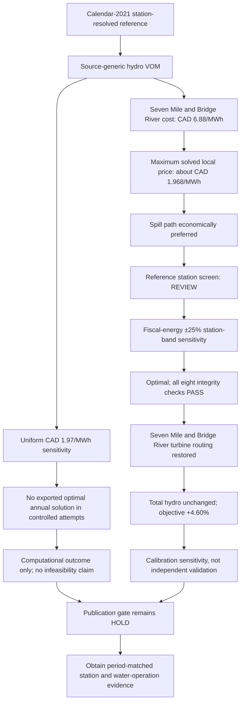

# Hydro dispatch policy sensitivity: publication methods and results

**Study period:** calendar 2021  
**Evidence status:** computational result plus cross-period calibration sensitivity  
**Publication status:** diagnostic evidence; independent operational validation remains incomplete

## Research question

The reference model routed almost all water around the Seven Mile and Bridge
River turbines while meeting provincial energy, electrical balance, release,
storage, and terminal-state constraints. We tested whether this behavior arose
from hydraulic topology or from the economic ordering created by generic hydro
variable operating and maintenance costs.

## Methods

### Reference formulation

We used the optimal 8,760-hour, calendar-2021 station-resolved cascade network.
The electrical network used a capacity-constrained transport formulation and
observed hourly BC Hydro interchange. The model imposed source-backed run-of-river
profiles, monthly Statistics Canada biomass and non-renewable combustible
calibration constraints, reservoir bounds, cyclic annual closure, and declared
minimum-release policies. Total Transfer Capability was not part of this analysis.

The source-generic hydro policy retained the variable operating and maintenance
cost assigned to each source technology class. This produced an effective cost
of CAD 1.97/MWh of electrical output at G.M. Shrum, Revelstoke, Mica, and Peace
Canyon, and CAD 6.88/MWh at Seven Mile and Bridge River. The network builder
scaled water-flow variables to million cubic metres per hour for numerical
conditioning and transformed link efficiencies and costs together; the audit
recovered the effective electrical-output cost as link marginal cost divided by
link efficiency.

### Economic-ordering diagnostic

For each named reservoir turbine, we compared its effective turbine cost with
the hourly marginal price at its electrical output bus. We counted an hour as
economically favorable when the local marginal price exceeded the turbine cost
by more than (10^{-6}) CAD/MWh. We also calculated annual electrical output
from the negative of the turbine link's output-port flow. This diagnostic
explains the solved optimization ordering; it does not compare the model with an
observed BC market price.

### Sensitivity policies

We evaluated two alternative policies.

1. **Uniform reservoir-hydro cost.** We set every reservoir turbine to CAD
   1.97/MWh while leaving physical constraints and calibration inputs unchanged.
   Controlled HiGHS simplex and interior-point attempts produced no exported
   optimal annual network under their stated execution bounds. We therefore do
   not report this formulation as a solved sensitivity or infer infeasibility.
2. **Named-station energy bands.** We retained source-generic costs and imposed
   a ±25% annual-energy band around BC Hydro's fiscal-year values at six
   reservoir-link stations. Kootenay Canal remained unconstrained because it is
   represented as a fixed-profile run-of-river generator.

For reservoir station (s), hourly electrical output (g_{s,t}), snapshot
weight (w_t), fiscal comparator (E_s^{obs}), and tolerance
(delta=0.25), the sensitivity added

\[
(1-\delta)E_s^{obs}\leq \sum_t w_t g_{s,t}\leq
(1+\delta)E_s^{obs}.
\]

The model expressed this constraint in GWh to reduce the numerical magnitude of
the linear-program right-hand side. The scaling is algebraically equivalent to
the MWh formulation.

### Solve and audit protocol

The accepted station-band sensitivity used HiGHS simplex with a 1,200-second
solver limit. The workflow exported a network only when PyPSA returned
`status=ok` and `termination=optimal`. The solved network then had to pass eight
checks: solver optimality, complete hourly chronology, exact external-boundary
fidelity, electrical balance, release compliance, reservoir bounds, cyclic
storage closure, and zero emergency-backstop use.

We treated BC Hydro's fiscal year ended 31 March 2021 as a station-energy screen,
not a like-for-like validation target for calendar 2021. Imposing the same
station-energy evidence in a sensitivity prevents that evidence from serving as
independent validation of the resulting station outputs.

## Results

### Generic costs explain the spill-path ordering

The source-cost reference produced a nearly uniform local marginal price of
approximately CAD 1.968/MWh across the named stations. The maximum price at
Seven Mile and Bridge River remained below their CAD 6.88/MWh turbine cost in
all 8,760 hours. Seven Mile generated 11.6 GWh and routed 0.34% of its water
through turbines; Bridge River generated 0 GWh and routed no water through its
turbine. The model therefore preferred zero-cost spill routes unless another
constraint forced generation.

This result identifies an optimization mechanism. It does not establish that
the generic cost is an appropriate station-level offer, that the marginal price
represents an observed market price, or that BC Hydro would operate the stations
in this manner.

### Station bands reallocated hydro without changing provincial supply

The station-band sensitivity solved optimally and passed all eight integrity
checks. Total hydro generation remained 62,240.291 GWh in both solutions, and
the provincial generation mix was unchanged. The policy redistributed energy
among reservoir stations: Seven Mile increased from 11.6 to 2,279.2 GWh and
Bridge River increased from 0 to 1,664.3 GWh. Their turbine-capture fractions
increased from 0.34% to 67.4% and from 0% to 64.1%, respectively.

The additional downstream output was offset mainly by lower G.M. Shrum and Mica
generation. G.M. Shrum decreased from 14,686.3 to 12,608.6 GWh, while Mica
decreased from 8,356.7 to 6,501.8 GWh. Revelstoke and Peace Canyon were
effectively unchanged. The model objective increased from 419.955 million to
439.254 million model monetary units, a 4.60% increase. The objective remains a
model diagnostic and is not a validated estimate of observed system cost.

Kootenay Canal remained at 1,713.2 GWh, 34.8% below its 2,626 GWh fiscal
comparator. Because Kootenay Canal uses a fixed source profile and was excluded
from the reservoir-link energy constraints, its discrepancy points to the
availability profile, accounting boundary, or period mismatch rather than the
reservoir spill policy.

## Interpretation

The sensitivity demonstrates that the cascade topology can route water through
Seven Mile and Bridge River when annual station output is constrained. The
reference's near-zero generation at those stations is therefore not caused by a
missing turbine connection or an unavoidable hydraulic bottleneck. It arises
from the interaction between generic turbine costs, free spill paths, and the
system objective.

The station-band result is not a validated replacement reference. It uses a
cross-period comparator and constrains outputs with the same evidence later used
for screening. A defensible primary policy still requires calendar-2021 station
generation, water releases, reservoir trajectories, or an independently justified
hydro-dispatch formulation. Until that evidence is available, the source-cost
case and station-band case should bracket a structural dispatch uncertainty.

## Decision schematic



## Publication-ready figure captions

**Figure: Economic ordering of named reservoir turbines.** Effective turbine
variable operating and maintenance cost and solved local marginal price for six
named reservoir stations in the calendar-2021 source-cost reference. Filled
circles show annual mean local marginal price, open circles show the annual
maximum, and squares show turbine cost per MWh of electrical output. Seven Mile
and Bridge River have CAD 6.88/MWh costs, above the maximum solved local price in
every hour. Marginal prices are model diagnostics, not observed market prices.

**Figure: Named-station hydro dispatch sensitivity.** Calendar-2021 modeled
station generation and turbine-capture fractions under the source-cost reference
and a ±25% station-energy-band sensitivity. Open circles show BC Hydro generation
for the fiscal year ended 31 March 2021. The sensitivity preserved total hydro
generation but shifted output from G.M. Shrum and Mica to Seven Mile and Bridge
River. The fiscal comparator defines a cross-period calibration sensitivity and
does not independently validate its output.

## Reproducibility

Primary code and evidence paths are:

| Purpose | Path |
|---|---|
| Hydro dispatch-cost policy | `src/pypsa_bc/studies/hydro_dispatch_policy.py` |
| Station energy-band constraints | `src/pypsa_bc/studies/station_validation.py` |
| Solve callback | `src/pypsa_bc/studies/cascade/constraints.py` |
| Optimal-only network export and execution metadata | `workflow/scripts/solve_model.py` |
| Economic-ordering audit | `workflow/scripts/studies/chapter2/audit_hydro_dispatch_economics.py` |
| Sensitivity comparison and figure | `workflow/scripts/studies/chapter2/compare_hydro_dispatch_sensitivities.py` |
| Retrospective execution register | `studies/chapter2/inputs/hydro_dispatch_sensitivity_attempts.json` |
| Economic diagnostic outputs | `results/workflow/sensitivities/hydro_dispatch_economics/` |
| Solved station-band network and audits | `results/workflow/sensitivities/station_energy_band_25pct/` |
| Comparative table, figure, and summary | `results/workflow/sensitivities/hydro_dispatch_comparison/` |

The workflow targets are:

```text
snakemake --snakefile workflow/Snakefile --cores 1 hydro_dispatch_economic_audit
snakemake --snakefile workflow/Snakefile --cores 1 hydro_dispatch_sensitivity_comparison
```

Re-solving the station-band network is opt-in because it is computationally
expensive and uses cross-period calibration evidence. Set
`execution.allow_solve: true` only after reviewing the evidence boundary.

## Current publication decision

The economic mechanism and the station-band sensitivity are reproducible and
suitable for a Methods section, diagnostic Results subsection, or supplement.
They do not clear the main publication gate. The reference still fails the
named-station energy screen, the sensitivity is calibrated to that screen, and
held-out operational validation remains unavailable.
