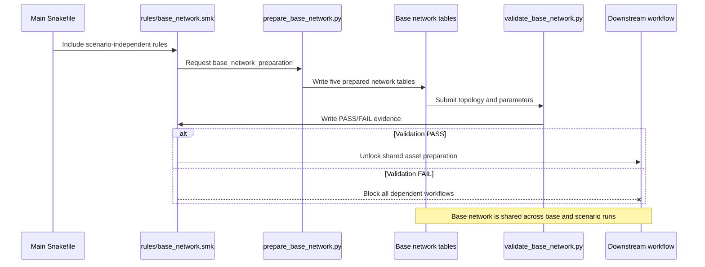

# PyPSA-BC Snakemake workflow

This workflow wraps the existing PyPSA-BC scripts in a dependency-aware base
model chain. Network construction, validation, and optimization are separate
operations; production solving remains opt-in.

## Contents

- [Safety model](#safety-model)
- [Major base-model rules](#major-base-model-rules)
- [Scenario-independent Rule 1 module](#scenario-independent-rule-1-module)
- [Running safely](#running-safely)
- [Learning Rule 1: base network preparation](#learning-rule-1-base-network-preparation)
- [Spatial-resolution contract](#spatial-resolution-contract)

## Safety model

The default target is a read-only preflight. It validates configuration and
required contracts, then writes `results/workflow/preflight.json`. It does not
rebuild data or solve a network.

`execution.allow_solve` is false by default. A base solve also requires the
prepared-network structural check and all scientific gate summaries to report
`PASS`. Existing prepared files retain their current locations; new prepared
and solved base networks are written under `results/workflow/base_model/`.

## Major base-model rules

The master target is `base_model_workflow`. It resolves this chain:

1. `base_network_preparation` — detailed buses, lines, line types, and
   transformers;
2. `asset_preparation` — hydro, wind, solar, and thermal inventories;
3. `profile_preparation` — supply time series and demand profiles;
4. `model_input_data_preparation`, then `model_file_preparation` — builder
   objects and an unsolved `network_prepared.nc`;
5. `network_validation`, plus the existing evidence and physics gates;
6. `solve_base_model` — optimization and `network_solved.nc`.

The scenario matrix is not part of this base-model master. Its targets remain
available separately for later hydro-policy experiments.

## Scenario-independent Rule 1 module

Base-network preparation and its QA gate are isolated in
`workflow/rules/base_network.smk`. The main `workflow/Snakefile` imports them
with:

```python
include: "rules/base_network.smk"
```

The included file owns the five-table `BASE_NETWORK` output contract, the
validation-output paths, `base_network_preparation`, and
`validate_base_network`. Downstream rules consume those outputs but do not
redefine Rule 1. Consequently, changing or adding scenario definitions does not
duplicate or modify base-network preparation; Snakemake builds it once whenever
a requested target requires it.



```text
CODERS + assumptions
        |
        v
base_network_preparation -> asset_preparation -> profile_preparation
        |                                           |
        +-------------------------------------------+
                                                    v
                                  model_input_data_preparation
                                                    |
                                                    v
                                      model_file_preparation
                                      (prepared, unsolved .nc)
                                                    |
                                                    v
                                        network_validation
                                                    |
                    evidence + physics gates -------+
                                                    v
                                          solve_base_model
                                                    |
                                                    v
                                         base_model_workflow
```

## Running safely

From the repository root, run the default preflight:

```powershell
uv run snakemake --profile workflow/profiles/default
```

Preview the complete base-model DAG without executing it:

```powershell
uv run snakemake --profile workflow/profiles/default --dry-run base_model_workflow
```

Prepare and structurally validate the model without solving:

```powershell
uv run snakemake --profile workflow/profiles/default network_validation
```

Only after reviewing every gate, set `execution.allow_solve: true`, then run:

```powershell
uv run snakemake --profile workflow/profiles/default base_model_workflow
```

## Learning Rule 1: base network preparation

First preview Rule 1. This reads the DAG and timestamps but does not rewrite the
five network CSV files:

```powershell
uv run snakemake --profile workflow/profiles/default --dry-run base_network_preparation
```

Then run only Rule 1:

```powershell
uv run snakemake --profile workflow/profiles/default --cores 1 base_network_preparation
```

The rule has four readable parts:

1. **Inputs** declare every file that can change the result: `config/data.yaml`,
   the electrical assumptions in `config/base_network.yaml`, CODERS lines,
   substations and generators, the line-rating table, and the Python adapter.
2. **Outputs** define the contract: `buses.csv`, `lines.csv`, `line_types.csv`,
   `transformers.csv`, and `transformer_types.csv` in
   `data/processed_data/network/`.
3. **Log** records execution in
   `logs/snakemake/01_base_network_preparation.log`.
4. **Run** invokes `workflow/scripts/prepare_base_network.py`. The adapter first
   prepares lines and line types, derives buses required by those lines, then
   creates transformers between voltage levels. The detailed transformations
   live in `src/pypsa_bc/network/`.

```mermaid
sequenceDiagram
    participant G as Grid data
    participant A as Electrical assumptions
    participant S as Snakemake Rule 1
    participant P as prepare_base_network.py
    participant L as network/lines.py
    participant B as network/buses.py
    participant T as network/transformers.py
    participant O as Base network tables

    Note over G: CODERS lines, substations,<br/>and generator coordinates
    Note over A: Power factor, conductor table,<br/>and transformer defaults

    G->>S: Declare tracked source files
    A->>S: Declare tracked assumptions
    S->>P: Run base-network adapter
    P->>L: Prepare lines and conductor inventory
    L->>O: Write lines.csv and line_types.csv
    P->>B: Resolve internal line endpoints
    B->>O: Write buses.csv
    P->>T: Connect voltage levels at physical nodes
    T->>O: Write transformers.csv and transformer_types.csv

    Note over B,O: External and unresolved endpoints are not invented;<br/>validation preserves their affected line references
```

The adapter is intentionally thin. Scientific transformations belong to the
three package modules, while Snakemake owns file dependencies, execution, and
logging. Bus preparation never creates a blank placeholder bus: unresolved
internal endpoints and external interties remain visible as missing-endpoint
evidence in `validate_base_network` until an explicit modelling decision is
implemented.

Snakemake reruns this rule when an output is missing, an input is newer, or the
rule/code signature changes. Before accepting Rule 1 scientifically, inspect
row counts, duplicate identifiers, missing endpoints, BC coordinate bounds,
nominal voltages, line lengths and ratings, isolated buses, connected
components, and transformer voltage pairs. These checks are implemented by the
`validate_base_network` rule.

Run Rule 1 and then validate it through the dependency graph:

```powershell
uv run snakemake --profile workflow/profiles/default validate_base_network
```

To audit the network CSV files exactly as they currently exist, without letting
Snakemake refresh an out-of-date Rule 1 first, call the evidence generator
directly:

```powershell
uv run python -m workflow.scripts.validate_base_network `
  --network-dir data/processed_data/network `
  --config config/base_network_validation.yaml `
  --output-dir results/workflow/base_network_validation
```

The rule writes `summary.json`, a Markdown report, and issue-level CSV evidence
under `results/workflow/base_network_validation/`. Evidence is retained even
when the status is `FAIL`; `asset_preparation` reads the summary and refuses to
continue until blocking checks pass. Thresholds and the broad BC coordinate
envelope are declared in `config/base_network_validation.yaml`.

## Spatial-resolution contract

The spatial-resolution strategy is:

- base/reference: regional-district network and regional-district demand;
- future detailed extension: substation topology plus an independently
  documented and validated substation-demand allocation;
- diagnostic: one-bus copperplate.

The base model therefore answers province-wide and regional questions about
hydro operation, reservoir representation, water-use policy, regional balance,
and inter-regional transmission. Stage 1 retains detailed substation source
data, but the builder aggregates it for the base solve. A future substation
model can address different questions—local congestion, substation loading,
connection siting, and within-region deliverability—without changing the
scientific definition of the regional-district base model.

This decision is recorded in `config/workflow.yaml` with both
`scientific_reference_resolution` and `executable_resolution` set to
`regional_district`.

## Hydro-policy scenarios (later phase)

`scenario_plan` compiles the reservoir-representation and water-policy matrix.
Exact scenario solves remain separate targets under `results/workflow/runs/`.
The evidence-based policy is declared but blocked until unresolved facility
release rules are resolved; uncertainty cases remain labelled sensitivities,
not observed or legal flows.

Use Snakemake's `--dag` or `--rulegraph dot` option to generate a graph for any
named target.
