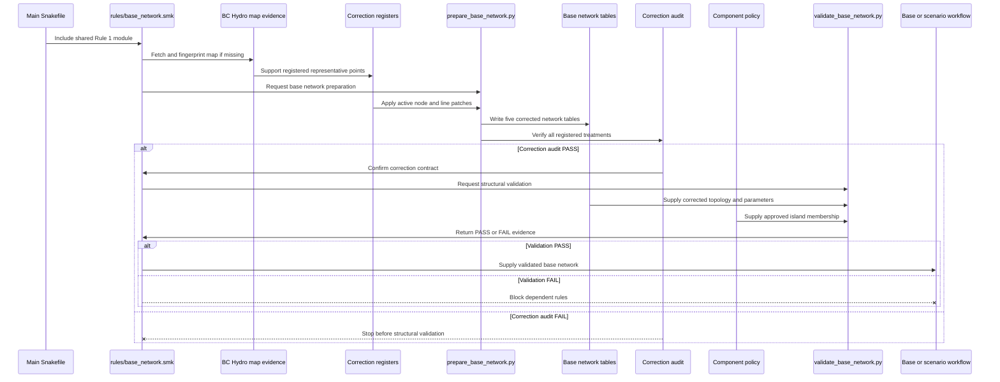
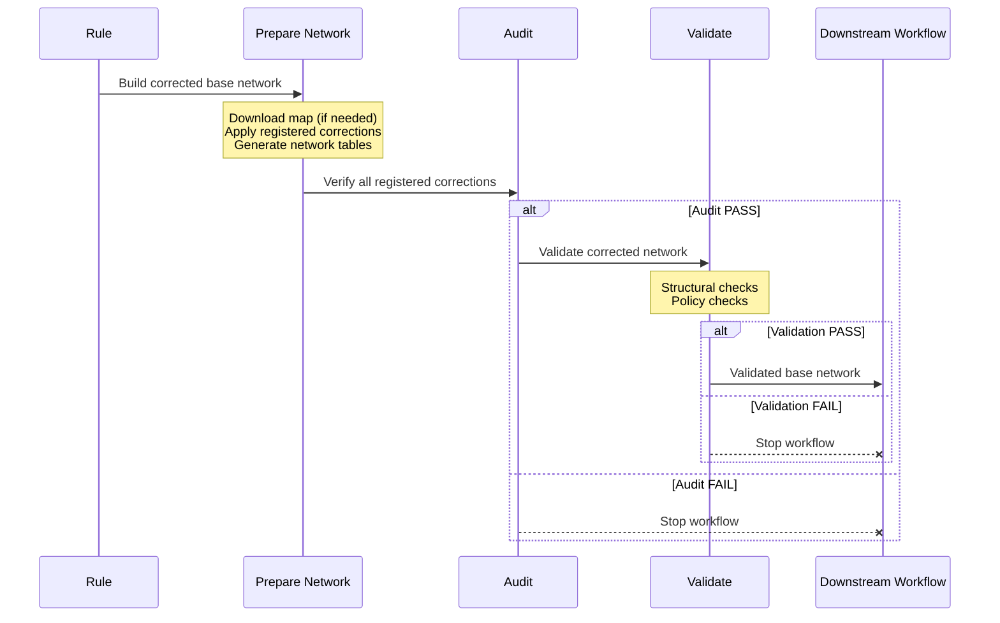
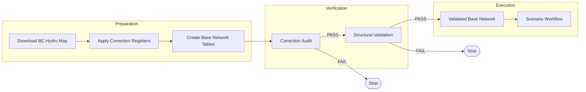
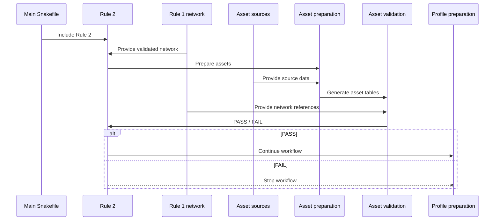
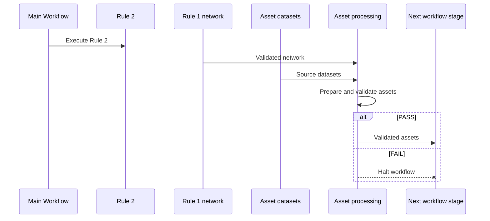

# Rule 1

```mermaid
sequenceDiagram
    participant M as Main Snakefile
    participant R as rules/base_network.smk
    participant E as BC Hydro map evidence
    participant C as Correction registers
    participant P as prepare_base_network.py
    participant N as Base network tables
    participant A as Correction audit
    participant Q as Component policy
    participant V as validate_base_network.py
    participant D as Base or scenario workflow

    M->>R: Include shared Rule 1 module
    R->>E: Fetch and fingerprint map if missing
    E->>C: Support registered representative points
    R->>P: Request base network preparation
    C->>P: Apply active node and line patches
    P->>N: Write five corrected network tables
    P->>A: Verify all registered treatments

    alt Correction audit PASS
        A->>R: Confirm correction contract
        R->>V: Request structural validation
        N->>V: Supply corrected topology and parameters
        Q->>V: Supply approved island membership
        V->>R: Return PASS or FAIL evidence

        alt Validation PASS
            R->>D: Supply validated base network
        else Validation FAIL
            R--xD: Block dependent rules
        end
    else Correction audit FAIL
        A--xR: Stop before structural validation
    end
```

simplified

```mermaid
sequenceDiagram
    participant R as Rule
    participant P as Prepare Network
    participant A as Audit
    participant V as Validate
    participant W as Downstream Workflow

    R->>P: Build corrected base network
    Note over P: Download map (if needed)<br/>Apply registered corrections<br/>Generate network tables

    P->>A: Verify all registered corrections

    alt Audit PASS
        A->>V: Validate corrected network
        Note over V: Structural checks<br/>Policy checks

        alt Validation PASS
            V->>W: Validated base network
        else Validation FAIL
            V--xW: Stop workflow
        end

    else Audit FAIL
        A--xW: Stop workflow
    end
```

```mermaid
flowchart LR

subgraph Preparation
A[Download BC Hydro Map]
B[Apply Correction Registers]
C[Create Base Network Tables]
end

subgraph Verification
D[Correction Audit]
E[Structural Validation]
end

subgraph Execution
F[Validated Base Network]
G[Scenario Workflow]
end

A --> B
B --> C
C --> D

D -- PASS --> E
D -- FAIL --> Stop1([Stop])

E -- PASS --> F
E -- FAIL --> Stop2([Stop])

F --> G
```

# Rule 2

```mermaid
sequenceDiagram
    participant M as Main Snakefile
    participant R as Rule 2
    participant B as Rule 1 network
    participant S as Asset sources
    participant P as Asset preparation
    participant V as Asset validation
    participant D as Profile preparation

    M->>R: Include Rule 2
    B->>R: Provide validated network
    R->>P: Prepare assets
    S->>P: Provide source data
    P->>V: Generate asset tables
    B->>V: Provide network references
    V->>R: PASS / FAIL

    alt PASS
        R->>D: Continue workflow
    else FAIL
        R--xD: Stop workflow
    end
```

for papers

```mermaid
sequenceDiagram
    participant M as Main Workflow
    participant R as Rule 2
    participant N as Rule 1 network
    participant S as Asset datasets
    participant A as Asset processing
    participant D as Next workflow stage

    M->>R: Execute Rule 2
    N->>A: Validated network
    S->>A: Source datasets
    A->>A: Prepare and validate assets

    alt PASS
        A->>D: Validated assets
    else FAIL
        A--xD: Halt workflow
    end
```

