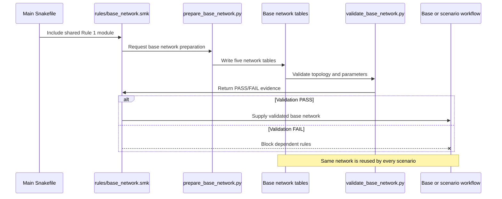

# Debunking Workflow ( Stage 1 of 5)
> `Rule 1` of snakemake workflow
---
`Rule 1` is the starting point. It establishes the electrical topology used by every later stage. Treat it as a reproducible data transformation followed by a separate scientific quality assurance (QA) exercise.

## 1. Overview
The rule is defined at [workflow/Snakefile](https://github.com/DeltaE/PyPSA_BC/blob/dev/workflow/rules/base_network.smk)


Rule 1 has:

- no scenario wildcards;
- no reservoir-policy inputs;
- no scenario-specific outputs;
- one fixed set of network tables;
- one shared validation result.
  
Therefore, multiple scenarios depending on the same network do not rebuild it separately. Snakemake prepares it once unless its inputs, code, configuration, or outputs change. 

It produces:

    data/processed_data/network/
    ├── buses.csv
    ├── lines.csv
    ├── line_types.csv
    ├── transformers.csv
    └── transformer_types.csv

The processing adapter is [prepare_base_network.py](https://github.com/DeltaE/PyPSA_BC/blob/dev/workflow/scripts/prepare_base_network.py).

The validation also produces:

    results/workflow/base_network_validation/
    ├── disconnected_components.csv
    ├── duplicate_identifiers.csv
    ├── invalid_buses.csv
    ├── missing_line_endpoints.csv
    ├── parallel_lines.csv
    ├── self_loops.csv
    ├── summary.json
    └── validation_report.md

The validation adapter is [validate_base_network.py](https://github.com/DeltaE/PyPSA_BC/blob/dev/workflow/scripts/validate_base_network.py).

## 2. Safely preview the rule
   
On the Linux machine, we start from the repository root:

```bash
cd /path/to/PyPSA_BC
```

```bash
uv run snakemake \
--profile workflow/profiles/default \
--dry-run \
base_network_preparation
```

The dry run tells us:
- which inputs Snakemake found;
- which outputs it expects;
- whether it intends to rerun Rule 1;
- why it intends to rerun it.

Look for the `reason:` line. Common reasons are:
  - an output is missing;
  - an input is newer;
  - the rule or its code changed;
  - an upstream rule will update an input.

```{hint}
A dry run does not replace the CSV files.
```

## 3. Preserve the current outputs
Before deliberately rebuilding Rule 1, record the existing state:

```bash
mkdir -p results/audit/rule1
```
```bash
sha256sum data/processed_data/network/*.csv \
  > results/audit/rule1/checksums_before.txt
```
```bash
cp -a data/processed_data/network \
  "results/audit/rule1/network_before_$(date +%Y%m%d_%H%M%S)"
```
This provides:
- a recoverable copy;
- checksums for testing reproducibility;
- evidence of exactly what changed.

## 4. Run snakemake's `Rule 1` only
   
```bash
uv run snakemake \
  --profile workflow/profiles/default \
  --cores 1 \
  base_network_preparation
```
This will not run assets, profiles, model construction, or optimization.

The log should appear at: `logs/snakemake/01_base_network_preparation.log`
Inspect it:
`less logs/snakemake/01_base_network_preparation.log`
Or search for warnings and errors: 
```bash
rg -n -i "warning|error|missing|assum|imput" \
logs/snakemake/01_base_network_preparation.log
```

## 5. Confirm delivered files
```bash
wc -l data/processed_data/network/*.csv
```
> Remember that wc -l includes the header. Therefore, a file showing 1,011 lines contains 1,010 data records.
The current files in this workspace contain:
| Output | Records |
|---|---:|
| Buses | 1,010 |
| Lines | 1,239 |
| Line types | 34 |
| Transformers | 110 |
| Transformer types | 18 |

After running on the other machine, compare these counts. Different counts are not automatically wrong, but they need an explanation tied to input or code changes.

## 6. Check reproducibility
After rebuilding:
```bash
sha256sum data/processed_data/network/*.csv \
  > results/audit/rule1/checksums_after.txt

diff -u \
  results/audit/rule1/checksums_before.txt \
  results/audit/rule1/checksums_after.txt
```
Possible outcomes:
- No difference: Rule 1 is deterministic for the current inputs.
- Expected differences: input data, configuration, or code changed.
- Unexpected differences: investigate ordering, unstable identifiers, hidden downloads, or nondeterministic processing.

## 7. Understand each output at `data/processed_data/network/*.csv`

`buses.csv`<br>
    Each row represents a bus at a particular substation and voltage level.
    Important columns:
    - name: unique PyPSA bus identifier;
    - x, y: longitude and latitude;
    - v_nom: nominal voltage in kV;
    - type: associated voltage/line type.
    
A physical substation can produce several buses when it contains several voltage levels. Transformers connect these voltage-specific buses.

Check:
  - bus names are unique;
  - coordinates are present and inside BC;
  - voltage is positive and plausible;
  - every line endpoint exists in this table.

`lines.csv`<br>
Each row represents a transmission circuit.
Important columns include:
  - bus0, bus1;
  - v_nom;
  - length;
  - s_nom;
  - type;
  - source identifiers such as transmission_line_id.

The current code calculates s_nom using:
  - 1. CODERS summer rating in MVA when available;
  - 2. otherwise summer MW divided by the configured 0.9 power factor.
  Review this in [lines.py (line 207)](E:/CoWork/PROJECTS/PyPSA/src/pypsa_bc/network/lines.py:207).
  > Duplicate endpoint names can be legitimate parallel circuits. Therefore, do not delete duplicate-looking lines until you compare their source line and circuit identifiers.

`line_types.csv`<br>
This contains electrical parameters used by PyPSA:
- resistance per kilometre;
- reactance per kilometre;
- capacitance per kilometre;
- current rating;
- nominal voltage.

Important assumptions currently include:
- voltage-to-reactance values from config/base_network.yaml;
- interpolation or substitution for unavailable voltage classes;
- capacitance currently assigned as an assumption;
- missing ampacity can be imputed from the modal value for the voltage class.

These assumptions need to appear in the model limitations and validation report.

`transformers.csv`<br>
    Transformers are inferred when the same physical location has buses at multiple voltage levels.
    Check:
    - bus0 and bus1 both exist;
    - the high-voltage side and low-voltage side differ;
    - transformer names are unique;
    - each transformer type exists in transformer_types.csv.

`transformer_types.csv`<br>
The present transformer parameters include important placeholders:
- `s_nom` = 2000 MVA;
- assumed short-circuit impedance;
- assumed losses;
- phase shift;
- tap limits and tap step.

These are suitable for constructing a preliminary network, but they require sensitivity testing before making strong transmission conclusions.

## 8. Validation
```bash
uv run snakemake \
  --snakefile workflow/Snakefile \
  validate_base_network

```

## 9. What the current outputs reveal
 
The existing output is not yet completely clean:
- 1 invalid bus row with missing name and coordinates;
- 10 lines referencing missing endpoints;
- 2 line self-loops;
- 1 line with zero nominal capacity;
- 4 separate valid connected components, sized 998, 6, 3, and 2 buses;
- 183 repeated line names, representing 348 rows.

Repeated line names may represent legitimate parallel circuits. The other findings—especially missing endpoints, the invalid bus, zero capacity, and disconnected components—should be investigated before using this network as the base solve.

The missing endpoints include several external interties, such as ABBC*_IPT and BCUS*_INT. Those may need explicit external buses rather than simply being discarded. Two missing internal endpoints around GST_JCT require separate source-data inspection.

## 10.  How to force a controlled rebuild
Normally, let Snakemake decide whether rebuilding is required. If you deliberately need to test `Rule 1` from scratch:
```bash
uv run snakemake \
  --profile workflow/profiles/default \
  --cores 1 \
  --forcerun base_network_preparation \
  base_network_preparation
```
Use this only after preserving the existing outputs because `Rule 1` writes over the five CSV files. Then run the validation again from [validation](#8-validation)
