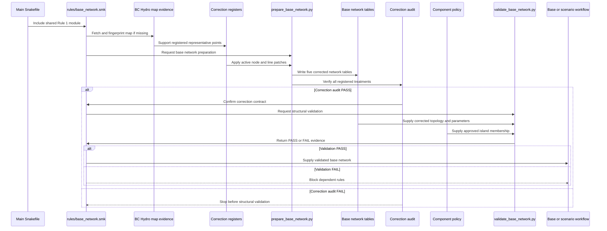

# Dissecting Rule 1: Base Network Preparation and Validation

> Rule 1 of the Snakemake workflow

Rule 1 establishes the electrical topology used by the base model and every
later scenario. It is a reproducible transformation of source data, registered
corrections, and electrical assumptions, followed by a separate structural
quality-assurance gate.

## Contents

- [Dissecting Rule 1: Base Network Preparation and Validation](#dissecting-rule-1-base-network-preparation-and-validation)
  - [Contents](#contents)
  - [1. Overview](#1-overview)
  - [2. Safely preview Rule 1](#2-safely-preview-rule-1)
  - [3. Preserve the current outputs](#3-preserve-the-current-outputs)
  - [4. Run Rule 1 only](#4-run-rule-1-only)
  - [5. Confirm the delivered files](#5-confirm-the-delivered-files)
  - [6. Check reproducibility](#6-check-reproducibility)
  - [7. Understand the outputs](#7-understand-the-outputs)
    - [`buses.csv`](#busescsv)
    - [`lines.csv`](#linescsv)
    - [`line_types.csv`](#line_typescsv)
    - [`transformers.csv`](#transformerscsv)
    - [`transformer_types.csv`](#transformer_typescsv)
    - [`correction_audit.csv`](#correction_auditcsv)
  - [8. Understand the correction layer](#8-understand-the-correction-layer)
  - [9. Run validation](#9-run-validation)
  - [10. Interpret the current validation result](#10-interpret-the-current-validation-result)
  - [11. Force a controlled rebuild](#11-force-a-controlled-rebuild)

---

## 1. Overview

The main [Snakefile](../Snakefile) imports the scenario-independent
[Rule 1 module](base_network.smk). The module owns both
`base_network_preparation` and `validate_base_network`.



Raw CODERS tables remain unchanged. Rule 1 applies special treatments from
version-controlled correction registers and records their effects in a separate
audit table.

Rule 1 has:

- no scenario wildcards;
- no reservoir-policy inputs;
- no scenario-specific outputs;
- one fixed set of prepared network tables;
- one correction audit;
- one shared structural-validation result.

Multiple scenarios that depend on the same base network do not rebuild it
separately. Snakemake reruns Rule 1 only when an input, correction register,
assumption, script, rule definition, or output state requires it.

## 2. Safely preview Rule 1

Start from the repository root on the Linux machine:

```bash
cd /path/to/PyPSA_BC
```

Preview preparation without rewriting its outputs:

```bash
uv run snakemake \
  --profile workflow/profiles/default \
  --dry-run \
  base_network_preparation
```

The dry run reports:

- which inputs Snakemake found;
- which outputs it expects;
- whether it intends to rerun Rule 1;
- why it intends to rerun it.

Inspect the `reason:` line. Common reasons include a missing output, a newer
input, modified code, or an upstream rule that will update an input.

> A dry run does not replace any prepared CSV files.

## 3. Preserve the current outputs

Before deliberately rebuilding Rule 1, record the existing state:

```bash
mkdir -p results/audit/rule1

sha256sum data/processed_data/network/*.csv \
  > results/audit/rule1/checksums_before.txt

cp -a data/processed_data/network \
  "results/audit/rule1/network_before_$(date +%Y%m%d_%H%M%S)"
```

This creates:

- a recoverable copy of the prepared tables;
- checksums for reproducibility testing;
- evidence of the exact state before rebuilding.

## 4. Run Rule 1 only

```bash
uv run snakemake \
  --profile workflow/profiles/default \
  --cores 1 \
  base_network_preparation
```

This target does not run asset preparation, profile preparation, model
construction, optimization, or scenario analysis.

The execution log is:

```text
logs/snakemake/01_base_network_preparation.log
```

Inspect it with:

```bash
less logs/snakemake/01_base_network_preparation.log
```

Search for notable messages with:

```bash
rg -n -i "warning|error|missing|assum|imput|correction" \
  logs/snakemake/01_base_network_preparation.log
```

## 5. Confirm the delivered files

Rule 1 writes five network tables and one correction audit:

```text
data/processed_data/network/
|-- buses.csv
|-- lines.csv
|-- line_types.csv
|-- transformers.csv
|-- transformer_types.csv
`-- correction_audit.csv
```

Inspect the file sizes and line counts:

```bash
ls -lh data/processed_data/network/*.csv
wc -l data/processed_data/network/*.csv
```

`wc -l` includes the header. For example, 1,019 lines in `buses.csv`
correspond to 1,018 bus records.

The current corrected outputs contain:

| Output | Records |
|---|---:|
| Buses | 1,018 |
| Lines | 1,237 |
| Line types | 34 |
| Transformers | 110 |
| Transformer types | 18 |
| Correction-audit entries | 22 |

Different counts are not automatically wrong, but every difference must be
traceable to changed inputs, assumptions, code, or correction registers.

## 6. Check reproducibility

After rebuilding:

```bash
sha256sum data/processed_data/network/*.csv \
  > results/audit/rule1/checksums_after.txt

diff -u \
  results/audit/rule1/checksums_before.txt \
  results/audit/rule1/checksums_after.txt
```

Interpret the result as follows:

- **No difference:** Rule 1 reproduced the current outputs exactly.
- **Expected difference:** A documented input, assumption, correction, or code
  change altered the outputs.
- **Unexpected difference:** Investigate unstable ordering, identifiers, hidden
  downloads, environment differences, or nondeterministic processing.

## 7. Understand the outputs

### `buses.csv`

Each row represents one voltage-specific electrical bus. Important columns are:

- `name`: unique PyPSA bus identifier;
- `x`, `y`: representative longitude and latitude;
- `v_nom`: nominal voltage in kV;
- `type`: voltage label.

A physical substation can create several buses when it contains several voltage
levels. Transformers connect those voltage-specific buses.

Check that:

- bus names are unique;
- coordinates are present and within the configured modelling envelope;
- nominal voltages are positive;
- every line endpoint references an existing bus.

The registered intertie and GST coordinates are representative modelling and
plotting points. They are not surveyed asset locations and must not be used to
derive engineering line lengths or impedances.

### `lines.csv`

Each row represents one retained transmission circuit. Important columns
include:

- `transmission_line_id` and `transmission_circuit_id`;
- `bus0` and `bus1`;
- `v_nom`;
- `length`;
- `s_nom`;
- `type`.

The preparation code calculates `s_nom` using:

1. CODERS summer rating in MVA when available;
2. otherwise, summer MW divided by the configured power factor of 0.9.

Review the implementation in [lines.py](../../src/pypsa_bc/network/lines.py).

Repeated endpoint names can represent legitimate parallel circuits. Do not
delete duplicate-looking lines until their source line and circuit identifiers
have been compared.

### `line_types.csv`

This table preserves the configured conductor inventory loaded from
`electric_power_generation_table_13_3a.xlsx`. It is not a foreign-key lookup for
the voltage labels in `lines.type`.

During later model construction, the builder supplies explicit resistance,
reactance, susceptance, and conductance values and clears the temporary line
type label. Consequently, Rule 1 validates the uniqueness of conductor codes
but does not require `lines.type` to match a conductor code.

The conductor inventory includes fields such as resistance, reactance,
capacitance, approximate current capacity, and cross-sectional area. The
electrical-parameter derivation used by the model builder requires separate
documentation and sensitivity testing.

### `transformers.csv`

Transformers are inferred when one physical location has buses at multiple
voltage levels. The code connects adjacent unique voltage levels from low to
high.

Check that:

- `bus0` and `bus1` both exist;
- the high- and low-voltage sides differ;
- transformer names are unique;
- every transformer type exists in `transformer_types.csv`.

### `transformer_types.csv`

The current standardized transformer assumptions include:

- `s_nom = 2,000 MVA`;
- short-circuit voltage and resistance assumptions;
- no-load loss and magnetizing-current assumptions;
- phase-shift and tap-changer assumptions.

These parameters prevent transformers from becoming unintended bottlenecks in
the preliminary topology. They require sensitivity testing before the model can
support strong conclusions about transformer-level constraints.

### `correction_audit.csv`

This table verifies that every active correction appears in the prepared
outputs. It records the correction ID, record type, source record, action,
status, observed result, source, and rationale.

Preparation raises an error if any correction receives a status other than
`PASS`. Structural validation therefore runs only after the correction contract
has been satisfied.

## 8. Understand the correction layer

Rule 1 never edits the raw CODERS files. It loads corrections from:

```text
data/validation/base_network/
|-- node_corrections.csv
|-- line_corrections.csv
|-- component_policy.yaml
|-- bc_hydro_transmission_system_2025.pdf
|-- bc_hydro_transmission_system_2025.metadata.json
`-- README.md
```

The current node register contains nine active treatments:

- one representative point for Goldstream Junction (`BC_GST_JCT`);
- four Alberta boundary buses;
- four United States boundary buses.

The current line register contains thirteen active treatments:

- line `32350` excluded as a collapsed Kidd self-loop;
- line `32731` excluded as a collapsed Dasque Creek self-loop;
- line `31876` assigned a 65 MW summer rating from adjacent `1L365`
  segments, producing `s_nom = 72.2222 MVA` after power-factor conversion;
- eight physical intertie segments retained for later fixed historical
  exchange treatment;
- GST lines `32550` and `32552` retained after restoring the junction.

The BC Hydro transmission map confirms the ordering of Mica, Goldstream
Junction, McCulloch Creek, and Goldstream Mine on circuit `60L223`. The GST
coordinate remains a manual representative treatment and is labelled as such
in the register.

## 9. Run validation

Run the structural validator through Snakemake:

```bash
uv run snakemake \
  --snakefile workflow/Snakefile \
  --cores 1 \
  validate_base_network
```

Because the prepared tables and correction audit are dependencies, Snakemake
rebuilds them first when they are missing or out of date.

The validator writes:

```text
results/workflow/base_network_validation/
|-- disconnected_components.csv
|-- duplicate_identifiers.csv
|-- invalid_buses.csv
|-- missing_line_endpoints.csv
|-- parallel_lines.csv
|-- parameter_outliers.csv
|-- self_loops.csv
|-- summary.json
`-- validation_report.md
```

The validator checks:

- required files and columns;
- valid and unique buses;
- line endpoint integrity;
- line self-loops;
- source-identifier uniqueness;
- parallel circuits and repeated display names;
- line lengths and capacities;
- transformer references and parameters;
- isolated buses;
- connected-component membership.

The component policy requires one dominant main component and allows only
documented islands with exact approved membership. The validator fails if an
island appears, disappears, gains a bus, or loses a bus without a reviewed
policy update.

## 10. Interpret the current validation result

The current corrected Rule 1 outputs pass every blocking structural check:

| Check | Current result |
|---|---:|
| Valid buses | PASS |
| Line endpoint integrity | PASS |
| Line self-loops | PASS |
| Electrical parameter validity | PASS |
| Connected-component policy | PASS |
| Isolated buses | PASS |

The connected components are:

| Component | Buses | Treatment |
|---|---:|---|
| Main BC network | 1,009 | Required dominant component |
| Fort Nelson remote system | 7 | Approved exact-membership island |
| Winchie Creek remote system | 2 | Approved exact-membership island |

Two warning classes remain:

- 348 line rows have repeated display names, representing 165 parallel groups;
- 56 line segments are shorter than the 0.05 km review threshold.

These warnings remain visible for review but do not block downstream rules.
Parallel circuits must retain unique source identifiers. Very short segments
require attention during electrical-parameter derivation and regional
aggregation.

A `PASS` result means that the corrected prepared tables satisfy the declared
Rule 1 structural contract. It does not prove power-flow feasibility, validate
historical exchange profiles, or establish that every electrical parameter is
authoritative.

## 11. Force a controlled rebuild

Normally, let Snakemake decide whether preparation must rerun. To deliberately
rebuild Rule 1 after preserving the existing outputs:

```bash
uv run snakemake \
  --profile workflow/profiles/default \
  --cores 1 \
  base_network_preparation \
  --forcerun base_network_preparation
```

Then run validation:

```bash
uv run snakemake \
  --profile workflow/profiles/default \
  --cores 1 \
  validate_base_network
```

Inspect the new correction audit and validation evidence before allowing any
dependent stage to run.
