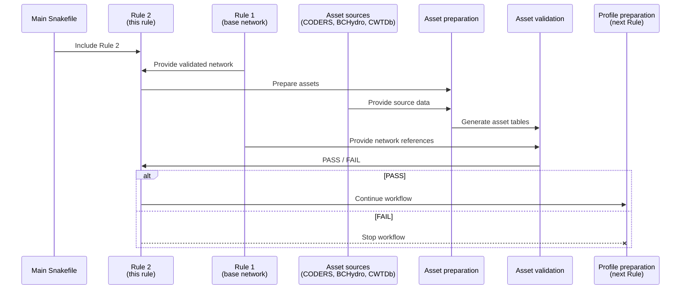

# Dissecting Rule 2: Asset Preparation and Validation

> Rule 2 of the Snakemake workflow

Rule 2 prepares the wind, solar, thermal, and hydro inventories consumed by
profile preparation and model construction. It is a scenario-independent
transformation followed by a separate structural validation gate. This first
validation pass records discrepancies; it does not silently correct source or
prepared data.

## Contents

- [Dissecting Rule 2: Asset Preparation and Validation](#dissecting-rule-2-asset-preparation-and-validation)
  - [Contents](#contents)
  - [1. Overview](#1-overview)
  - [2. Safely preview Rule 2](#2-safely-preview-rule-2)
  - [3. Preserve and rebuild the assets](#3-preserve-and-rebuild-the-assets)
  - [4. Understand the outputs](#4-understand-the-outputs)
  - [5. Run validation](#5-run-validation)
  - [6. Interpret the initial result](#6-interpret-the-initial-result)
  - [7. Correction boundary](#7-correction-boundary)

## 1. Overview

The main [Snakefile](../Snakefile) imports the dedicated
[Rule 2 module](assets.smk). The module owns `ASSETS`, the preparation rule,
the validation rule, and all Rule 2 validation paths.



`Rule 2` has no scenario wildcards and writes one shared asset set. Preparation
requires a passing `Rule 1` summary. Profile preparation requires a passing `Rule
2` summary. The validation command always writes its evidence and returns
normally; the downstream gate is where a `FAIL` blocks further work.

## 2. Safely preview Rule 2

From the repository root, preview preparation without rewriting outputs:

```powershell
uv run snakemake --profile workflow/profiles/default --dry-run asset_preparation
```

Preview the preparation-plus-validation dependency graph:

```powershell
uv run snakemake --profile workflow/profiles/default --dry-run validate_assets
```

Inspect each `reason:` line. Rule 2 reruns when an output is missing or when a
tracked source, configuration, script, upstream Rule 1 artifact, or rule
definition is newer.

## 3. Preserve and rebuild the assets

Before a deliberate rebuild, copy the current prepared directories and record
checksums. One possible PowerShell audit sequence is:

```powershell
New-Item -ItemType Directory -Force results/audit/rule2 | Out-Null
Get-FileHash data/processed_data/*/existing/*.csv |
  Export-Csv results/audit/rule2/checksums_before.csv -NoTypeInformation
Copy-Item data/processed_data results/audit/rule2/processed_data_before -Recurse
```

Run only preparation:

```powershell
uv run snakemake --profile workflow/profiles/default --cores 1 asset_preparation
```

The execution log is `logs/snakemake/02_asset_preparation.log`. Rule 2 invokes
the existing `prepare_assets.py` adapter, which runs wind, solar, thermal, and
hydro sub-pipelines in sequence.

## 4. Understand the outputs

The output contract is:

```text
data/processed_data/
|-- wind/existing/bc_ext_wind_assets.csv
|-- solar/existing/bc_ext_solar_assets.csv
|-- tpp/existing/bc_ext_tpp_assets.csv
`-- hydro/existing/
    |-- hydro_generation.csv
    |-- hydro_reservoirs.csv
    `-- hydro_cascade.csv

data/downloaded_data/wind/turbine_dict.json
```

The current prepared record counts are:

| Output | Records |
|---|---:|
| Wind generating units | 10 |
| Solar generating units | 3 |
| Thermal generating units | 38 |
| Hydro generating assets | 118 |
| Hydro reservoirs | 21 |
| Hydro cascade source rows | 76 |

The declared grains are intentionally table-specific. Identifiers must be
unique within their own table; Rule 2 does not assume that every technology
uses the same identifier column.

## 5. Run validation

Run preparation when required and validate through Snakemake:

```powershell
uv run snakemake --profile workflow/profiles/default --cores 1 validate_assets
```

To validate the files exactly as they currently exist, without allowing
Snakemake to rebuild them first:

```powershell
uv run python -m workflow.scripts.validate_assets `
  --config config/assets_validation.yaml `
  --output-dir results/workflow/asset_validation
```

The validator writes:

```text
results/workflow/asset_validation/
|-- duplicate_identifiers.csv
|-- hydro_reference_issues.csv
|-- invalid_capacities.csv
|-- invalid_coordinates.csv
|-- invalid_technology_labels.csv
|-- schema_issues.csv
|-- summary.json
|-- unmapped_network_nodes.csv
|-- validation_report.md
`-- wind_turbine_coverage.csv
```

It checks:

- required columns and table-specific identifier uniqueness;
- positive generation capacities and known reservoir storage;
- coordinates against a broad BC modelling envelope;
- the declared technology vocabulary;
- generating-asset mappings to voltage-specific Rule 1 buses;
- wind configuration coverage by the turbine dictionary;
- internal hydro reservoir references, while allowing named external river
  sinks as model boundaries.

Thresholds and controlled vocabularies are declared in
`config/assets_validation.yaml` rather than embedded in the Snakemake rule.

## 6. Interpret the initial result

The first validation of the existing prepared files reports `FAIL` with one
blocking class:

| Check | Findings | Treatment now |
|---|---:|---|
| Base-network mapping | 1 | Blocking; retain evidence |
| Missing reservoir maximum storage | 2 | Warning; retain evidence |

The blocking row is thermal unit `BC_KGE03_GEN`, whose
`connecting_node_code` is `BC_WEY_ISS`. No voltage-specific Rule 1 bus has the
`WEY_ISS` source-node suffix. The two warnings are reservoirs `BC_WDN_RES` and
`BC_WAN_RES`, whose prepared `max_storage` values are blank.

All current required-column, identifier, coordinate, positive known-capacity,
technology-vocabulary, wind-turbine-coverage, and internal hydro-reference
checks pass. A structural `PASS` would still not prove electrical feasibility,
authoritative nameplate capacity, or hydro-policy validity.

## 7. Correction boundary

No correction is applied in this Rule 2 implementation. The validator makes
the current mismatch and missing evidence explicit so a later review can
choose among source correction, a version-controlled correction register,
network-node restoration, documented exclusion, or a policy-based warning.

Do not weaken a blocking check merely to allow downstream execution. Any later
correction should identify the affected record, expected source value,
replacement or exclusion, evidence, rationale, and audit result, following the
traceability pattern established by Rule 1.
